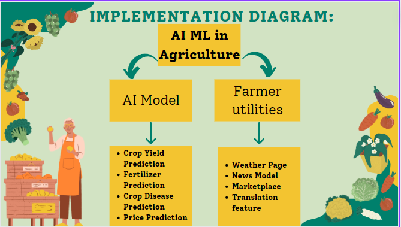
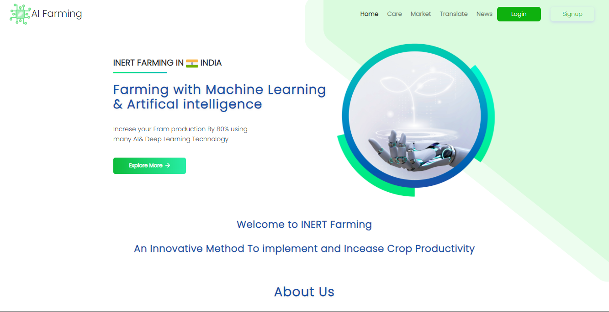

# INERT Farming

# Problem Statement:

World cereal equivalent (CE) food demand is projected to be around 10,094 million tons in 2030 and 14,886 million tons in 2050, while its production is projected to be 10,120 million tons in 2030 and 15,970 million tons in 2050 having a marginal surplus.

India and China are capturing large share of global food demand.

# Implementation Diagram

# Crop Yield Prediction

It is based on following parameters:

● Nitrogen

● Phosphorous

● State

● City

● pH

● Rainfall

State and City parameters are used by the Weather API to get the current
temperature, rainfall, Humidity details for the specific location.
All these parameters are fed to the Model for prediction
Here, the Random Forest algorithm gives us the maximum accuracy.
Based on
prediction, Output is displayed on screen

# Fertilizer Prediction

Existing Fertilizer dataset is used and this is used as a training and testing datasets.
User inputs

● Nitrogen

● Phosphorous

● Soil Type

Weather Details ( Temperature, Humidity, Moisture ) are fetched via API call.

Based on data given, output box is displayed on screen having details such as

● Conventional recommended fertilizer

● Organic alternatives to this fertilizer

● General Information

● Dosage for crops

# Price Prediction

Each year, the Government releases a price index called WPI (Wholesale price
Index). Wholesale price indexes are reported monthly in order to show the
average price changes of goods.

To get the current price for the current year, we use the following formula
Current price = WPI * Base Price(for the ongoing year)

Using previous year data, predictions have been made to indicate what might be
the

● maximum price

● average predicted price

● minimum price

Graph is also plotted. Left graph shows the projected price while the right graph
shows the history of the crop prices from 2012 to 2019.

Sarimax Time series forecasting model is being used for the prediction of the
future crop prices. This model can predict prices upto 4-5 years accurately.

# Crop Disease Prediction

The farmer has to upload an image to the website from his/her device. Deep
Learning models are used is to find the disease that occurred and details about
the disease and its cure are given to the farmer.

# Farmer News

Farmers can stay up to date with the latest news in the agricultural domain with
help of the news portal. The news is dynamically fetched and is updated every
day.

From various sites, news is gathered via web crawling and then displayed on
the news portal.

On Clicking on the 'Read Full Article' button, the user is directed to the web page
from where the news was fetched from.

# Marketplace

Farmers can directly contact the sellers and hence can save on money and can
maximize profits.
He/She has to enter details such as crop to be sold, asking price,
quantity and contact details and these details can be forwarded to the sellers.

#Working of the project

Steps : 
1. Instll all the Requiremnt modules present in the requirement.text 
2. Run all the notebook file which is present in notebook folder
3. Check for all the required pickle files after running the notebook files 
4. Run app.py 

References:

● Crop yield prediction using machine learning algorithms - International
Journal of Recent Technology and Engineering (IJRTE)

● Crop Condition Assessment using Machine Learning - International Journal
of Recent Technology and Engineering (IJRTE)

● Open Government Data (OGD) Platform India

● Kaggle: Your Machine Learning and Data Science Community

